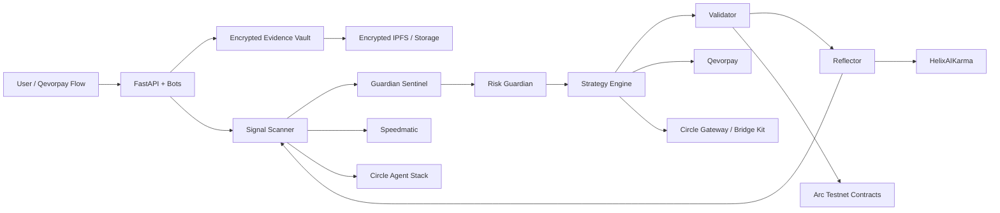

# NOTARY

**Autonomous legal witness and payment intelligence terminal on Arc.**

NOTARY is a 6-agent self-improving swarm and Qevorpay side product that turns ordinary payments into verified, conditional, agent-managed USDC flows. It observes real-world and onchain events, including audio/video evidence through Speedmatic, produces evidence-grade signed attestations and probability predictions, hashes reasoning traces to Arc, lets users buy micro-shares in its next output through Nanopayments, bridges USDC from any supported chain through Circle Gateway, executes bounded treasury arbitrage, and triggers instant payments through Qevorpay.

> NOTARY decides. Qevorpay pays. Arc remembers.

## Core Primitive

NOTARY is a legally embodied AI witness that researches, predicts, arbitrages, attests, and pays.

Under the hood, it creates **Witness-to-Pay**: machine witnesses that turn verified facts into programmable USDC movement.

```text
Observation -> Attestation -> Prediction -> Payment / Trade -> Karma Update
```

## Why Arc

NOTARY treats Arc as the Economic OS for autonomous machine witnesses:

- **Identity:** ERC-8004-style identity registry, Circle Agent Wallet, EIP-712 signer
- **Memory:** attestation hashes, reasoning trace hashes, transcript hashes, operating agreement hash
- **Money:** USDC treasury, Gateway deposits, Qevorpay flows, Paymaster fees
- **Markets:** micro-shares, pay-to-peek traces, prediction accuracy shares
- **Risk:** confidence thresholds, dispute windows, payment limits, slippage caps
- **Governance:** operating agreement, policy DNA, upgrade rules, replication rules
- **Reputation:** karma, accuracy, safety, payment reliability, dispute rate, PnL
- **Privacy:** encrypted evidence vaults, redaction rules, disclosure policies, access grants
- **Execution:** payments, arbitrage, USYC yield, bridge/swap/send actions

Arc is not just where NOTARY settles. Arc is where NOTARY lives.

## Demo Flow

```text
Upload audio
-> Speedmatic transcript
-> NOTARY extracts obligations and acceptance
-> Guardian Sentinel verifies evidence integrity
-> Risk Guardian approves release
-> Validator signs an EIP-712 attestation
-> Arc stores the proof hash
-> Qevorpay releases USDC
-> Reflector updates karma
```

## Architecture



## 6-Agent Swarm

1. **Signal Scanner** finds signals from Speedmatic transcripts, paid data, market feeds, smart contracts, Qevorpay events, social sentiment, non-English news, work logs, delivery proofs, and arbitrage opportunities.
2. **Guardian Sentinel** verifies source integrity, transcript authenticity, anti-drainer/anti-rug risk, malicious inputs, and privacy leaks.
3. **Risk Guardian** authorizes attestations, predictions, Qevorpay triggers, arbitrage actions, pay-to-peek sales, and public disclosure.
4. **Strategy Engine** creates payment links, releases escrow, sends batch distributions, opens pay-to-peek markets, routes treasury actions, and executes Witness-to-Pay.
5. **Validator** signs EIP-712 attestations, predictions, payment authorizations, karma checkpoints, operating agreement hashes, privacy policies, and governance acts.
6. **Reflector** critiques every cycle, updates onchain karma, adjusts policy DNA, and proposes governance changes.

## Privacy Modes

Privacy is optional; data leakage is not.

- **Public:** public attestation, public summary, optional transcript excerpts.
- **Protected:** encrypted raw evidence, public hash and summary, role-based excerpts.
- **Private:** only hash, timestamp, and signature on Arc; disclosure by signed grant or dispute policy.

Arc stores commitments. Users control evidence.

## Contracts

- `NotaryIdentityRegistry.sol` - ERC-8004-style identity records for machine witnesses.
- `HelixAIKarma.sol` - signed karma checkpoints and reputation scores.
- `AttestationRegistry.sol` - attestation, prediction, evidence, and reasoning trace commitments.
- `NotaryValidationRegistry.sol` - transcript, Qevorpay, dispute, and external validation records.
- `NotaryGovernance.sol` - operating agreement, policy DNA, privacy policy, and upgrade records.

## Setup

### Requirements

- Python 3.12+
- Node/Foundry or preferred Solidity toolchain
- ARC CLI
- Circle Agent Stack credentials
- Qevorpay credentials
- Speedmatic credentials

### Install

```bash
python -m venv .venv
. .venv/Scripts/activate  # Windows PowerShell: .venv\Scripts\Activate.ps1
pip install -e ".[dev]"
cp .env.example .env
```

### Environment

See `.env.example` for all settings. The app works locally with SQLite state and local Qevorpay-style payment links before production provider credentials are connected:

```env
NOTARY_DEMO_MODE=true
SPEEDMATIC_DEMO_MODE=true
QEVORPAY_DEMO_MODE=true
ARC_DEMO_MODE=true
```

When real provider credentials are added, set the relevant provider mode to `false` and configure the API base URL, key, and webhook secrets.

### Run Live App

The fastest working path is dependency-light and runs with the standard library server:

```bash
python main.py
```

Then open `http://127.0.0.1:8000`.

Use this path for local demos when dependency installation is slow or unavailable.

### Run FastAPI

```bash
uvicorn apps.api.main:app --reload
```

Open `http://127.0.0.1:8000` for the dashboard. From there you can create a Notary, paste a transcript, choose privacy mode, run Witness-to-Pay, and create local Qevorpay payment links.

### Run One Swarm Cycle

```bash
python scripts/run_cycle.py
```

### Generate Operating Agreement

```bash
python scripts/generate_operating_agreement.py
```

## Agora Judge Demo Script

1. Open `notaryonarc.com` dashboard or Telegram bot.
2. Create a Notary.
3. Upload a voice note or work-call recording.
4. Speedmatic returns a transcript.
5. NOTARY extracts payment conditions and signs an attestation.
6. Arc records proof commitments.
7. Qevorpay releases or creates the conditional USDC payment.
8. The dashboard shows karma, privacy mode, payment status, and attestation proof.

## Legal Notice

NOTARY produces evidence-grade signed attestations modeled on U.S. Federal Rules of Evidence 901/902 authentication patterns [experimental; not legal advice or a guarantee of admissibility].

The zero-member LLC / Wyoming DAO LLC / Bayern mechanism module is an experimental legal-operational framework and is not legal advice.
